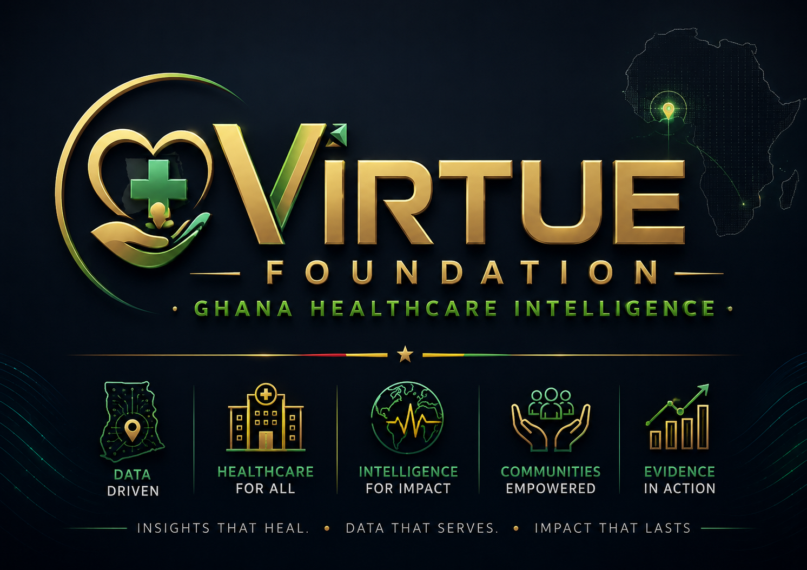
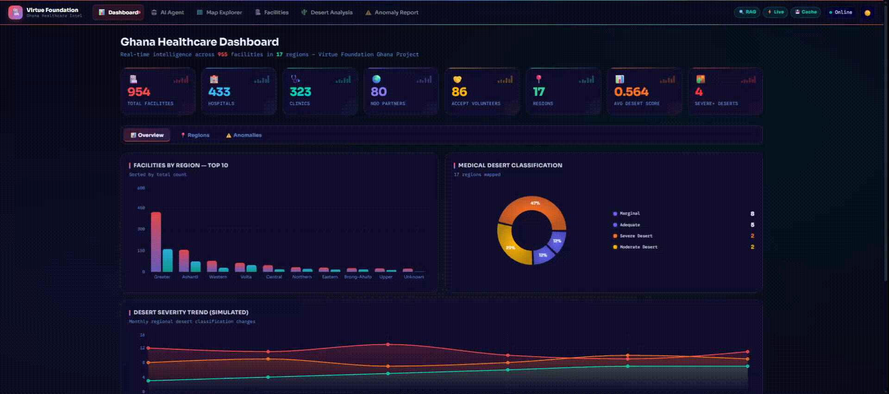
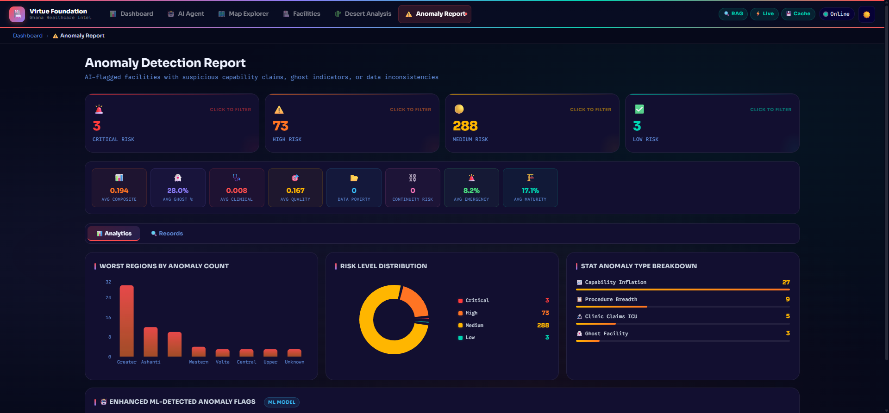
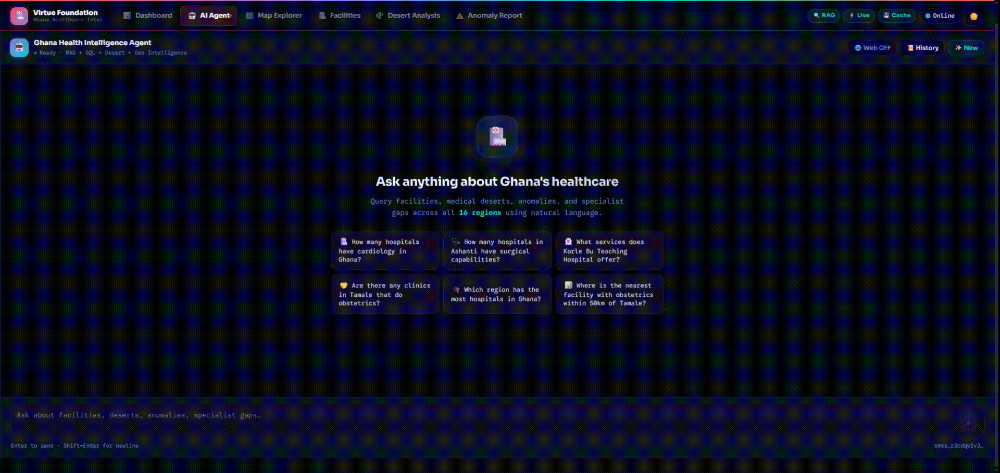
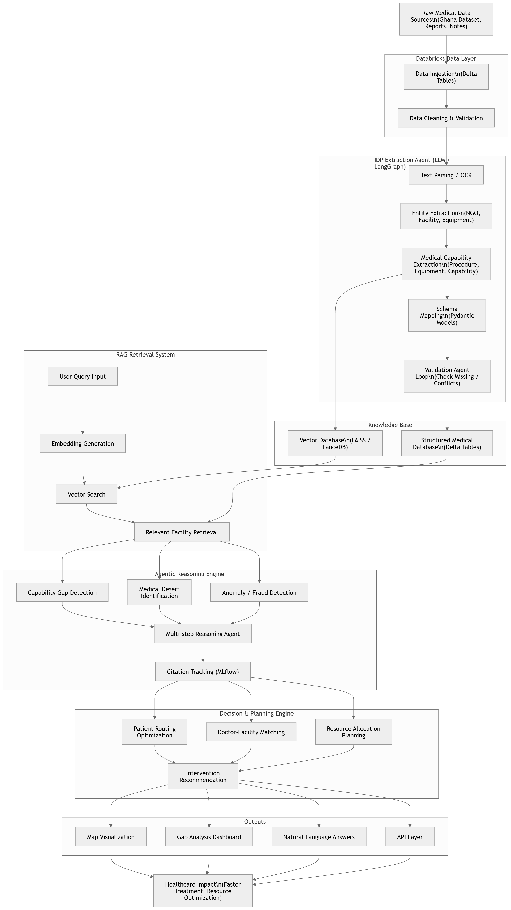

<div align="center">

<br/>

<!--  -->

### *Bridging Medical Deserts with AI, Agentic Orchestration & Databricks*

<br/>

[](https://databricks.com)
[](https://fastapi.tiangolo.com)
[](https://react.dev)
[](https://langchain-ai.github.io/langgraph/)
[](https://python.org)

[](https://faiss.ai)
[](https://llama.meta.com)
[](https://mlflow.org)
[](https://vercel.com)
[](LICENSE)

<br/>

**[🚀 Live Demo](https://virtue-foundation-ghana-dd.vercel.app)** · **[📖 Architecture](#%EF%B8%8F-architecture--data-flow)** · **[🤖 Agent Docs](#-langgraph-14-node-agent)** · **[⚡ Quickstart](#-quickstart)**

> ⚠️ *Initial load may take ~2 min due to cold starts. Refresh once for optimal performance.*

</div>

---

## 🌍 What Is This?

The **Virtue Foundation Ghana Healthcare Intelligence Platform** is a next-generation, full-stack agentic AI system built for the **Databricks × Accenture Hackathon**. It transforms raw, unstructured healthcare facility data from across Ghana into a living, queryable intelligence layer — exposing critical medical deserts, data anomalies, staffing gaps, and intervention opportunities through a conversational AI agent and an interactive geospatial dashboard.

Designed for **NGO planners, clinicians, and data scientists**, the platform enables evidence-based healthcare resource allocation where it matters most.

---

## 📊 Pipeline Results at a Glance

<div align="center">

| Metric | Value |
|:---|---:|
| 🏥 Facilities Processed | **900+** |
| 🗺️ Ghana Regions Scored | **16** |
| ⚠️ Anomalies Flagged | **340+** |
| 🔴 Severe Medical Deserts | **2** (Savannah, Upper East) |
| 🟢 Adequate Coverage Regions | **5** (incl. Greater Accra, Eastern) |
| 🩺 Specialties Mapped | **30+** |
| 🧠 IDP Extraction Phases | **15** per record |
| 🤖 LangGraph Agent Nodes | **14** |
| 💬 MoSCoW Query Categories | **59** |
| 📐 Dashboard Views | **6** distinct pages |

</div>

---

## 🌵 Medical Desert Score Sample Output

<div align="center">

| Region | Label | MDS Score | Critical Gaps |
|:---|:---|:---:|:---|
| Savannah | 🔴 **Severe Desert** | `0.87` | Emergency Medicine · Surgery · Obstetrics · Pediatrics |
| Upper East | 🔴 **Severe Desert** | `0.84` | Emergency Medicine · Surgery · Obstetrics |
| Bono East | 🟡 **Moderate Desert** | `0.68` | General Surgery |
| Oti | 🟡 **Moderate Desert** | `0.71` | Pediatrics · Mental Health |
| Greater Accra | 🟢 **Adequate** | `0.39` | — |
| Eastern | 🟢 **Adequate** | `0.49` | — |

> **MDS (Medical Desert Score):** `0.0` = full coverage · `1.0` = complete healthcare desert

</div>

---

## 📸 Platform in Action

### 📊 Dashboard — Live KPI Intelligence
#### *Real-time KPI counters showing total facilities, hospitals, clinics, NGO partners, average Medical Desert Scores, and critical region counts across Ghana's 16 administrative regions.*


---

### 🗺️ Map Explorer — Geospatial Visualization
#### *Interactive Leaflet map with 900+ geocoded facility markers, medical desert heatmap overlays, regional boundary polygons, and facility detail popups with clinical capability badges.*


---

### 🌵 Desert Analysis — Regional Vulnerability Scoring
#### *Regional Medical Desert Scores (MDS) ranked by severity, with specialty gap breakdowns, bed-to-population ratio charts, and AI-generated recommended intervention actions.*


---

### ⚠️ Anomaly Report — Clinical Data Integrity
#### *Data integrity flags sorted by severity — automatically detecting impossible configurations such as clinics claiming ICU capabilities with zero doctors or no electricity supply.*


---

### 🤖 AI Agent — Real-Time Chat Interface
#### *Streaming chat panel with step-by-step reasoning timeline, dynamically generated SQL code display, document citations with confidence scores, and suggested query prompts.*


---

### 🏥 Facility Explorer — Searchable Registry
#### *Searchable and filterable registry of all 900+ healthcare facilities with clinical capability badges, infrastructure status, operator type classification, and geographic metadata.*


---

## ✨ Core Capabilities

### 🧠 Intelligent Document Parsing (IDP)
A **15-phase extraction pipeline** powered by **Llama-3 70B** via Databricks Model Serving. Splits entities into facilities vs. NGOs, parses free-form clinical narratives into structured arrays of procedures, equipment, and capabilities, then maps everything to 30+ standardized medical specialty categories.

### 🌵 Medical Desert Detection & Scoring
Computes a **Medical Desert Score (MDS)** per region based on bed counts, doctor-to-population ratios, specialty coverage, and infrastructure. Ranks all 16 Ghana regions from `0.0` (adequate) to `1.0` (severe desert) and surfaces actionable intervention recommendations.

### ⚠️ Anomaly Detection & Data Audit
Rule-based engine that cross-checks equipment claims against reported staffing and infrastructure. Flags implausible records (e.g., ICU claims with zero staff, surgical equipment without electricity) with severity labels and confidence scores.

### 🤖 Agentic Natural Language Interface
A compiled **14-node LangGraph StateGraph** routes every query through exactly the right combination of SQL, RAG, geospatial, and reasoning nodes — then synthesizes a unified answer with **row-level citations**, SQL trace, and confidence scores, streamed live via **Server-Sent Events (SSE)**.

### 🗺️ Interactive Geospatial Dashboard
React + Leaflet dashboard with **choropleth desert heatmaps**, geocoded facility markers, regional boundary layers, and facility detail popups — built for field planners who need spatial context.

### 🔁 Dual-Mode Retrieval (Databricks + FAISS)
Databricks Vector Search is the primary retrieval backend. A precomputed **local FAISS index** (`faiss_index.bin`) enables fully offline demos and production fallback with no code changes.

---

## 🛠️ Architecture & Data Flow

```
┌─────────────────────────────────────────────────────────────────────────────┐
│                           DATA INGESTION LAYER                              │
│                                                                             │
│   Raw CSVs ──┐                                                              │
│   GeoJSON   ─┼──► 01_ingest_bronze ──► bronze_facilities_raw (Delta)       │
│   Text PDFs ─┘                                                              │
└────────────────────────────────┬────────────────────────────────────────────┘
                                 │ ETL
                                 ▼
┌─────────────────────────────────────────────────────────────────────────────┐
│                         SILVER CLEANING LAYER                               │
│                                                                             │
│   02_transform_silver ──► silver_facilities_cleaned (Delta)                 │
│   (Dedup · Geo-parse · Standardize operators · Validate · E.164 phones)     │
└────────────────────────────────┬────────────────────────────────────────────┘
                                 │ Enrich
                                 ▼
┌─────────────────────────────────────────────────────────────────────────────┐
│                          GOLD ENRICHMENT LAYER                              │
│                                                                             │
│   03_build_gold ────────────────► gold_facilities_enriched                  │
│   04_idp_agent  (Llama-3 70B) ──► gold_idp_enriched                        │
│   07_desert_scoring ────────────► gold_medical_desert_scores                │
│   08_anomaly_detection ─────────► gold_anomaly_flags                        │
└──────────────┬──────────────────────────────┬───────────────────────────────┘
               │ Embed & Index                │ Query
               ▼                             ▼
┌──────────────────────────┐   ┌─────────────────────────────────────────────┐
│  Databricks Vector Search │   │              FastAPI Backend                │
│  Index (Primary RAG)      │   │  ┌───────────────────────────────────────┐ │
│                           │   │  │   LangGraph 14-Node StateGraph        │ │
│  + FAISS Local Fallback   │◄──┤  │   router → sql/rag/geo/anomaly/...    │ │
│  (faiss_index.bin)        │   │  │   → synthesiser → SSE stream          │ │
└──────────────────────────┘   │  └───────────────────────────────────────┘ │
                               │  Redis Cache · SQL Warehouse Connector      │
                               └─────────────────────┬───────────────────────┘
                                                     │ SSE / REST
                                                     ▼
                               ┌─────────────────────────────────────────────┐
                               │         React Frontend (Vite + TS)          │
                               │                                             │
                               │  📊 Dashboard  ·  🗺️ Map Explorer           │
                               │  🤖 AI Agent   ·  🏥 Facility Explorer      │
                               │  🌵 Desert Analysis  ·  ⚠️ Anomaly Report   │
                               └─────────────────────────────────────────────┘
```
---


---

## 🗄️ `databricks/notebooks/` — Deep Dive

The Databricks notebooks implement the full **Medallion Architecture** (Bronze → Silver → Gold), AI extraction, anomaly detection, and vector indexing pipelines. Every notebook is numbered to reflect its execution order.

### 🥉 Bronze Layer — Raw Ingestion

#### [`01_ingest_bronze_v2.ipynb`](databricks/notebooks/01_ingest_bronze_v2.ipynb)
- **Role**: Entry point for the entire data pipeline.
- **Input Sources**: Raw CSV facility registries, `ghana_facilities.geojson` boundary file, and unstructured free-text NGO reports.
- **Process**: Reads multi-format sources using PySpark, applies minimal schema enforcement, and writes as-is into Unity Catalog Delta Lake.
- **Output Table**: `virtue_foundation.ghana.bronze_facilities_raw`

---

### 🥈 Silver Layer — Cleaning & Standardization

#### [`02_transform_silver.ipynb`](databricks/notebooks/02_transform_silver.ipynb)
- **Role**: Data quality and standardization layer.
- **Process**:
  - Drops exact duplicate records using SHA hashing on key columns.
  - Parses and validates latitude/longitude coordinates — strips non-numeric artifacts, coerces to float.
  - Standardizes `region` names to match official Ghana administrative districts.
  - Formats telephone numbers to international E.164 standard.
  - Maps inconsistent operator names (e.g. "faith-based", "FBO", "religious") to canonical categories.
  - Handles null fields with configurable defaults per column type.
- **Output Table**: `virtue_foundation.ghana.silver_facilities_cleaned`

---

### 🥇 Gold Layer — Enrichment, Scoring & AI Extraction

#### [`03_build_gold.ipynb`](databricks/notebooks/03_build_gold.ipynb)
- **Role**: Geospatial enrichment and administrative boundary mapping.
- **Process**: Performs a geospatial join using facility `lat/lon` coordinates against the GeoJSON polygon collection to determine the official `region`, `district`, and `sub-district` for every record.
- **Output Table**: `virtue_foundation.ghana.gold_facilities_enriched`

#### [`04_idp_agent.ipynb`](databricks/notebooks/04_idp_agent.ipynb) · [`04_idp_agent.py`](databricks/notebooks/04_idp_agent.py)
- **Role**: Core **Intelligent Document Processing (IDP)** engine. The most complex notebook in the pipeline.
- **Process** — 15-phase extraction pipeline powered by **Llama-3 70B** via `ai_query()`:
  1. **Entity Classification**: Splits records into `facility`, `ngo`, or `other_organization`.
  2. **Free-Form Parsing**: Extracts unstructured paragraphs into `procedures[]`, `equipment[]`, and `capabilities[]` arrays.
  3. **Specialty Ontology Mapping**: Maps extracted procedures (e.g. `"cesarean section"`) to 30+ standardized medical specialty codes (e.g. `gynecologyAndObstetrics`).
  4. **Null-Fill Batching**: Clusters missing attributes (email, website, founding year) and resolves them in a single batched LLM call.
  5. **Confidence Scoring**: Assigns an extraction confidence score to each enriched record.
- **Execution Mode**: Uses `ThreadPoolExecutor` with 12 parallel threads for concurrent model serving calls.
- **Output Table**: `virtue_foundation.ghana.gold_idp_enriched`

#### [`07_medical_desert_scoring.ipynb`](databricks/notebooks/07_medical_desert_scoring.ipynb)
- **Role**: Healthcare accessibility vulnerability calculator.
- **Process**: Computes a composite **Medical Desert Score (MDS v12)** per region using:
  - `density_component`: Facilities and hospitals per 100k population.
  - `specialty_component`: Weighted score based on presence/absence of 10 critical specialties.
  - `integrity_component`: Penalizes low data quality and high anomaly rates.
  - `confidence_component`: Adjusts score based on completeness of source data.
  - Final `blended_mds`: Weighted average of all four components (v12 algorithm).
- **Output**: Desert label categories: `Severe Desert`, `Moderate Desert`, `Marginal`, `Adequate`.
- **Output Table**: `virtue_foundation.ghana.gold_medical_desert_scores`

#### [`08_anomaly_detection_v2.ipynb`](databricks/notebooks/08_anomaly_detection_v2.ipynb)
- **Role**: Clinical plausibility and data integrity auditor.
- **Process**: Evaluates 20+ rule-based checks including:
  - ICU beds reported with zero clinical staff.
  - Surgical capabilities claimed without anaesthesia equipment.
  - Advanced diagnostics reported without electricity infrastructure.
  - Hospital beds count exceeding documented room capacity by >10×.
  - Coordinates outside Ghana's geographic bounding box.
- **Output Table**: `virtue_foundation.ghana.gold_anomaly_flags`

---

### 🔍 RAG Indexing & Agent Prototyping

#### [`05_rag_build_index.ipynb`](databricks/notebooks/05_rag_build_index.ipynb)
- **Role**: Semantic search index builder.
- **Process**:
  - Generates vector embeddings from facility descriptions, clinical narratives, and capability summaries using a Databricks BGE embedding endpoint.
  - Synchronizes embeddings to a **Databricks Vector Search Index** on `gold_idp_enriched`.
  - Simultaneously writes a local **FAISS index** (`faiss_index.bin`) and metadata (`faiss_metadata.json`) to `backend/rag_data/` as an offline fallback.
- **Output**: Live Databricks VS index + local FAISS binary files.

#### [`06_langgraph_agent.ipynb`](databricks/notebooks/06_langgraph_agent.ipynb)
- **Role**: Development prototyping workspace.
- **Purpose**: Used to design and test LangGraph node logic, intent classification routing, and tool validation before porting to the FastAPI backend.
- **Output & Test Demo**:
```
========================================================================
VIRTUE FOUNDATION v5.1 EVALUATION SUITE (24 queries)
========================================================================

[1.1] 'How many hospitals have cardiology in Ghana?'

======================================================================
Query      : How many hospitals have cardiology in Ghana?
Type       : regional_analysis (simple)
Plan       : ['sql']
Steps      : ['Router → regional_analysis | sql → []', "SQL: 1 rows | ['virtue_foundation.ghana.gold_facilities_enriched']", 'Synthesiser: answer assembled']
Confidence : 0.10 | Halluc risk: 0.30
Citations  : 0 fac | 3 nodes
MLflow     : 98995c62a0244918ab9e7ebc4610d965
======================================================================

Answer:
According to facility records, there are 20 hospitals with cardiology services in Ghana. This information suggests that cardiology care is available in various parts of the country, but I would need more specific data to determine the distribution of these hospitals across Ghana's 16 regions. For instance, I couldn't find information on which specific regions have the highest concentration of hospitals with cardiology services. (moderate confidence)

To better understand the availability of cardiology services, I recommend collecting more detailed data on the location and capacity of these hospitals. This could involve analyzing facility records from each region to identify areas with limited access to cardiology care.

Recommended actions:
- Conduct a regional analysis to identify areas with limited access to cardiology services
- Collect more detailed data on hospital capacity and location
- Develop strategies to improve access to cardiology care in underserved regions

An interactive map with hospital locations could help visualize the distribution of cardiology services across Ghana, but this would require more detailed geolocation data.

  Type     : ✅ got='regional_analysis' expected='regional_analysis'
  Answer   : ✅ (1159 chars)
  Cits     : 0 fac / 3 nodes
  Quality  : conf=0.10 | halluc=0.30

[1.2] 'How many hospitals in Ashanti region have surgery?'

======================================================================
Query      : How many hospitals in Ashanti region have surgery?
Type       : regional_analysis (simple)
Plan       : ['sql']
Steps      : ['Router → regional_analysis | sql → []', "SQL: 1 rows | ['virtue_foundation.ghana.gold_facilities_enriched']", 'Synthesiser: answer assembled']
Confidence : 0.10 | Halluc risk: 0.30
Citations  : 0 fac | 3 nodes
MLflow     : e30ed92790b8486a9e154d66fd817c95
======================================================================

Answer:
According to facility records, 16 hospitals in the Ashanti region have surgery capabilities. This information suggests that a significant number of healthcare facilities in the region are equipped to provide surgical services. 

An interactive map with 16 markers is ready to provide a visual representation of these hospitals.

Recommended actions: 
1. Conduct further analysis to assess the capacity and quality of surgical services at these hospitals.
2. Identify areas within the Ashanti region where access to surgical care may be limited, to inform targeted interventions.
3. Consider collaborating with local health authorities to strengthen surgical services and improve health outcomes in the region.

  Type     : ✅ got='regional_analysis' expected='regional_analysis'
  Answer   : ✅ (709 chars)
  Cits     : 0 fac / 3 nodes
  Quality  : conf=0.10 | halluc=0.30

[1.3] 'What services does Korle Bu Teaching Hospital offer?'
FAISS loaded: 972 vectors from /Workspace/Users/raychaudhurianurag@gmail.com/Databricks-Ghana-Health-Intel/databricks/rag/faiss_index.bin

======================================================================
Query      : What services does Korle Bu Teaching Hospital offer?
Type       : facility_lookup (simple)
Plan       : ['rag']
Steps      : ['Router → facility_lookup | rag → []', 'RAG: 10 results', 'Synthesiser: answer assembled']
Confidence : 1.00 | Halluc risk: 0.10
Citations  : 6 fac | 3 nodes
MLflow     : b6167397107d4f638cbd92af4dfbe421
======================================================================

Answer:
According to facility records, Korle Bu Teaching Hospital, located in Accra, Greater Accra, offers various services. The hospital has specialties in cardiology and cardiac surgery, and provides procedures such as Electrocardiogram (ECG) testing, 2D Echocardiography (ECHO) testing, Exercise Stress Test, and Cardiac Consultation services. Additionally, open heart surgeries are performed at the National Cardiothoracic Centre of the Korle Bu Teaching Hospital.

It's worth noting that the Reproductive Health Centre - Korle Bu Teaching Hospital, also located in Accra, Greater Accra, offers services such as gynecology and obstetrics, family planning and complex contraception, and reproductive endocrinology and infertility. They also provide procedures like Cervical cancer screening, Cervical cancer vaccination, and Family planning services.

Recommended actions for programme officers could include collaborating with Korle Bu Teaching Hospital to support their cardiology and reproductive health services, and exploring opportunities to strengthen their capacity to provide specialized care. (Moderate confidence) 

An interactive map with 6 markers is ready to provide a visual representation of the locations of these facilities.

  Type     : ✅ got='facility_lookup' expected='facility_lookup'
  Answer   : ✅ (1237 chars)
  Cits     : 6 fac / 3 nodes
  Quality  : conf=1.00 | halluc=0.10

[1.4] 'Are there any clinics in Kumasi that do dialysis?'

======================================================================
Query      : Are there any clinics in Kumasi that do dialysis?
Type       : facility_lookup (simple)
Plan       : ['rag']
Steps      : ['Router → facility_lookup | rag → []', 'RAG: 7 results', 'Synthesiser: answer assembled']
Confidence : 1.00 | Halluc risk: 0.10
Citations  : 6 fac | 3 nodes
MLflow     : 92d22a2c7df948f5b98780eb2b7be017
======================================================================

Answer:
According to facility records, there is at least one clinic in Kumasi that provides dialysis services: FirstCare Health Services, located in Kumasi, Ashanti. The clinic offers renal dialysis services, among other specialties such as internal medicine, gynecology and obstetrics, otolaryngology, general surgery, pediatrics, and psychiatry. 

It's worth noting that while FirstCare Health Services is the only clinic in Kumasi that we found to offer dialysis services, there are other dialysis clinics in Ghana, specifically in Accra, Greater Accra, such as Global Dialysis Centre, FAB Mercy Dialysis Center, and Labone Dialysis Centre. 

Recommended actions: 
- Verify the current availability and accessibility of dialysis services at FirstCare Health Services in Kumasi.
- Consider partnering with other dialysis clinics in Accra to expand access to dialysis services in Ghana.
- Support the development of more dialysis clinics in regions outside of Accra to address the medical desert status in those areas. 

Confidence level: High confidence in the existence of FirstCare Health Services and its dialysis services, moderate confidence in the comprehensiveness of the list of dialysis clinics in Ghana.

  Type     : ✅ got='facility_lookup' expected='facility_lookup'
  Answer   : ✅ (1207 chars)
  Cits     : 6 fac / 3 nodes
  Quality  : conf=1.00 | halluc=0.10

[1.5] 'Which region in Ghana has the most hospitals?'

======================================================================
Query      : Which region in Ghana has the most hospitals?
Type       : regional_analysis (simple)
Plan       : ['sql']
Steps      : ['Router → regional_analysis | sql → []', "SQL: 1 rows | ['virtue_foundation.ghana.gold_regional_summary']", 'Synthesiser: answer assembled']
Confidence : 0.10 | Halluc risk: 0.30
Citations  : 0 fac | 3 nodes
MLflow     : b822ab89dc9440859fa9db87d3673250
======================================================================

Answer:
According to facility records, the Greater Accra region in Ghana has the most hospitals. Unfortunately, with the current data, I can only confirm that Greater Accra region is a major hub for hospitals, but I don't have enough information to provide a comprehensive ranking of all 16 regions in Ghana (moderate confidence). 

To better understand the distribution of hospitals across Ghana, I would recommend collecting more data from the remaining 15 regions, including Ashanti, Brong-Ahafo, and others. 

An interactive map with 1 marker is ready, highlighting the Greater Accra region. 

Recommended actions: 
1. Conduct a thorough survey to gather data on hospital distribution in all 16 regions of Ghana.
2. Collaborate with local health authorities to validate the collected data and identify areas with limited access to healthcare facilities.
3. Develop targeted interventions to address disparities in hospital distribution and improve healthcare access in underserved regions.

  Type     : ✅ got='regional_analysis' expected='regional_analysis'
  Answer   : ✅ (985 chars)
  Cits     : 0 fac / 3 nodes
  Quality  : conf=0.10 | halluc=0.30

[2.1] 'How many hospitals treating malaria are within 50km of Accra?'

======================================================================
Query      : How many hospitals treating malaria are within 50km of Accra?
Type       : geo_search (moderate)
Plan       : ['geo', 'medical']
Steps      : ["Router → geo_search | geo → ['medical']", 'Geo: 24 facilities within 50.0km of Accra | 0 cold spots', 'Medical reasoning: 4058 chars', 'Synthesiser: answer assembled']
Confidence : 0.80 | Halluc risk: 0.31
Citations  : 0 fac | 4 nodes
MLflow     : 010e99a23ca64ee9ac1bcb99f9994426
======================================================================

Answer:
According to facility records, there are 24 facilities within 50km of Accra. However, not all of them are hospitals or have the capability to treat malaria. Based on the provided data, it is challenging to determine the exact number of hospitals treating malaria within 50km of Accra without more specific data on each facility's capabilities regarding malaria treatment.

From the given examples, facilities like *Mizprom Herbal Centre, **Pearl Dental Clinic, and **Nyaho Medical Centre* have some capabilities that might include malaria treatment, but they are not all hospitals and have varying levels of service richness. For instance, *Nyaho Medical Centre* is a clinic with surgery and obstetrics capabilities but lacks ICU and radiology services.

7 of 17 regions in Ghana lack comprehensive healthcare services, and the region of Greater Accra, where Accra is located, faces workforce and infrastructure gaps, particularly in rural areas within the 50km radius. The gaps include a lack of specialized healthcare workers, inadequate equipment, and potential gaps in referral systems between different levels of healthcare facilities.

An interactive map with 24 markers is ready to visualize the locations of these facilities.

Recommended actions:
1. Conduct a thorough assessment of each facility's capabilities regarding malaria treatment to determine the exact number of hospitals treating malaria within 50km of Accra.
2. Address the workforce and infrastructure gaps in the region, particularly in rural areas, by increasing the number of healthcare professionals trained in infectious diseases and providing adequate equipment.
3. Develop and implement effective referral systems between different levels of healthcare facilities to ensure comprehensive care for patients with malaria and other conditions.

Confidence level: Moderate confidence due to the limited data provided and the need for further assessment of each facility's capabilities.

  Type     : ✅ got='geo_search' expected='geo_search'
  Answer   : ✅ (1969 chars)
  Cits     : 0 fac / 4 nodes
  Quality  : conf=0.80 | halluc=0.31

[2.2] 'Which facilities are within 30km of Tamale?'

======================================================================
Query      : Which facilities are within 30km of Tamale?
Type       : geo_search (moderate)
Plan       : ['geo', 'medical']
Steps      : ["Router → geo_search | geo → ['medical']", 'Geo: 23 facilities within 30.0km of Tamale | 0 cold spots', 'Medical reasoning: 3280 chars', 'Synthesiser: answer assembled']
Confidence : 0.80 | Halluc risk: 0.31
Citations  : 0 fac | 4 nodes
MLflow     : 89995ae85e1e49a49d8309263849ee56
======================================================================

Answer:
According to facility records, 23 facilities are within 30km of Tamale, in the Northern region of Ghana. Specifically, the following facilities are notable:

1. *Cape Coast Teaching Hospital*: Located 1.6km from Tamale, it offers a comprehensive range of services including emergency medicine, surgery, ICU, obstetrics, radiology, and pediatrics. However, its name suggests it should be in Cape Coast, not Tamale, which may indicate an error.
2. *Universal Health Clinic*: Also 1.6km from Tamale, it provides limited services, including radiology, but lacks critical services like emergency medicine, surgery, ICU, obstetrics, and pediatrics.
3. *Ummah Medical Center*: Listed as a hospital, 1.6km from Tamale, but it lacks all specified medical services, which is unusual for a functioning hospital and may indicate incomplete data or that it's not operational as described.

These findings suggest significant gaps in healthcare service provision in the area, including a lack of comprehensive services in clinics and inconsistent service provision among hospitals. There's also a potential mislocation of Cape Coast Teaching Hospital and a risk that Ummah Medical Center might be a ghost facility or have significantly incomplete data.

Recommended actions:
- Verify the location and operational status of Cape Coast Teaching Hospital and Ummah Medical Center.
- Assess the workforce and infrastructure gaps in the Northern region, particularly around Tamale, to inform strategic planning and resource allocation.
- Conduct further investigations into facilities with inconsistent or missing data to ensure accurate healthcare planning and service provision.

An interactive map with 23 markers is ready to provide a visual representation of these facilities and their distances from Tamale. However, due to the inconsistencies and potential errors in the data, the confidence level in these findings is moderate.

  Type     : ✅ got='geo_search' expected='geo_search'
  Answer   : ✅ (1922 chars)
  Cits     : 0 fac / 4 nodes
  Quality  : conf=0.80 | halluc=0.31

[2.3] 'Where are the largest geographic cold spots where surgery is abse'

======================================================================
Query      : Where are the largest geographic cold spots where surgery is absent?
Type       : desert_analysis (complex)
Plan       : ['geo', 'desert', 'sql']
Steps      : ["Router → desert_analysis | desert → ['geo', 'sql']", 'Desert: 17 regions | 2 Severe | 2 cold spots', 'Geo: 69 facilities within 50.0km of Accra | 4 cold spots', "SQL: 14 rows | ['virtue_foundation.ghana.gold_medical_desert_scores']", 'Synthesiser: answer assembled']
Confidence : 0.90 | Halluc risk: 0.20
Citations  : 0 fac | 5 nodes
MLflow     : 8e4f307306364cf992395afabb7b6f9a
======================================================================

Answer:
According to facility records, 7 of 14 regions in Ghana lack surgical capabilities, with the Savannah region being the most severely affected. The Savannah region has a medical desert score of 0.8736, indicating a severe lack of healthcare services, including surgery. 

In the Savannah region, there are 4 facilities, but none of them offer surgical services. The region also lacks emergency medicine, obstetrics, and pediatrics, making it a significant cold spot for healthcare services. 

Other regions with high medical desert scores and lacking surgical capabilities include Upper East (0.8433), Bono East (0.6859), and Western North (0.6671). 

An interactive map with 14 markers is ready to visualize the medical desert scores and missing capabilities across different regions.

Recommended actions for the Savannah region include:
1. URGENT: Deploy emergency medicine capacity — zero coverage detected
2. URGENT: No surgical capacity — patients cannot receive operative care
3. URGENT: No obstetrics — elevated maternal mortality risk

These recommendations are based on the severe lack of healthcare services in the region, and addressing these gaps is crucial to improving healthcare outcomes for the population. (High confidence)

  Type     : ⚠️ got='desert_analysis' expected='geo_search'
  Answer   : ✅ (1240 chars)
  Cits     : 0 fac / 5 nodes
  Quality  : conf=0.90 | halluc=0.20

[4.1] 'Which facilities have implausible ICU claims without infrastructu'

======================================================================
Query      : Which facilities have implausible ICU claims without infrastructure?
Type       : anomaly_analysis (complex)
Plan       : ['anomaly', 'graph', 'medical']
Steps      : ["Router → anomaly_analysis | anomaly → ['graph', 'medical']", 'Anomaly: 30 flagged | report: 10 regions', 'Capability graph: 30 findings', 'Medical reasoning: 3200 chars', 'Synthesiser: answer assembled']
Confidence : 0.85 | Halluc risk: 0.33
Citations  : 0 fac | 5 nodes
MLflow     : af912a14637f4f9fadc5763220bd5934
======================================================================

Answer:
Based on our analysis of facility data from the Bono East and Greater Accra regions, we have identified several facilities with implausible ICU claims without infrastructure. 

Specifically, 2 of 5 hospitals in the Greater Accra region have high-risk levels due to capability dependency gaps and equipment mismatches. The Greater Accra Regional Hospital, for example, has 13 capability dependency gaps, including icu:oxygen, icu:patient_monitoring, and icu:trained_staff, with a moderate confidence level (0.87). 

Another facility, the Garden City Royal Hospital and Cancer Centre, claims to perform surgery but has no equipment and fewer than 2 procedures, which is implausible, with a confidence level of 0.88.

In the Bono East region, the Ahmadiyya Muslim Hospital, Techiman, claims to have a 100-bed capacity but has no doctors and no equipment, raising significant concerns about its operational credibility, with a low capability confidence score (0.0).

An interactive map with 3 markers is ready to visualize the locations of these facilities.

Recommended actions:

1. Verify the existence and capabilities of the Ahmadiyya Muslim Hospital, Techiman, and the Garden City Royal Hospital and Cancer Centre.
2. Conduct a thorough assessment of the infrastructure and equipment at the Greater Accra Regional Hospital to address the identified capability dependency gaps.
3. Provide targeted support and resources to these facilities to improve their service delivery and reduce the risk of misrepresentation.

These recommendations are based on our analysis of facility data and have a moderate to high confidence level (0.8-0.9).

  Type     : ✅ got='anomaly_analysis' expected='anomaly_analysis'
  Answer   : ✅ (1637 chars)
  Cits     : 0 fac / 5 nodes
  Quality  : conf=0.85 | halluc=0.33

[4.2] 'Show facilities with enhanced ghost hospital flags'

======================================================================
Query      : Show facilities with enhanced ghost hospital flags
Type       : anomaly_analysis (complex)
Plan       : ['anomaly', 'graph', 'medical']
Steps      : ["Router → anomaly_analysis | anomaly → ['graph', 'medical']", 'Anomaly: 30 flagged | report: 10 regions', 'Capability graph: 30 findings', 'Medical reasoning: 4124 chars', 'Synthesiser: answer assembled']
Confidence : 0.85 | Halluc risk: 0.33
Citations  : 0 fac | 5 nodes
MLflow     : da6b1da60dee42f8a8515afde3de4b4b
======================================================================

Answer:
Based on our analysis of facility data from the Bono East region and other areas, we have identified several facilities with enhanced ghost hospital flags. These flags indicate potential discrepancies in the reported capabilities and actual operational status of these healthcare facilities.

1. *Ahmadiyya Muslim Hospital, Techiman* in the Bono East region has been flagged due to its claimed 100-bed capacity and various medical services, yet it reportedly has no doctors and no equipment. This discrepancy raises significant concerns about its operational credibility.

2. *Greater Accra Regional Hospital* and *Garden City Royal Hospital and Cancer Centre*, both located in the Greater Accra region, also show signs of potential misrepresentation of their capabilities. The Greater Accra Regional Hospital lacks equipment despite a high service richness score, and the Garden City Royal Hospital and Cancer Centre claims to perform surgeries without the necessary equipment or sufficient procedures.

Our analysis reveals that 2 out of 10 facilities in the Greater Accra region and 1 out of 5 facilities in the Bono East region lack essential equipment or have significant capability dependency gaps. Specifically, 4 of 17 regions in our dataset have facilities with enhanced ghost hospital flags, indicating a need for verification of facility existence and capabilities.

According to facility records, Ahmadiyya Muslim Hospital, Techiman, has a total anomaly score of 5 and a composite anomaly score of 0.4183, categorizing it as a high-risk facility. The clinical assessment of this hospital, along with others like the Greater Accra Regional Hospital and the Garden City Royal Hospital and Cancer Centre, suggests a moderate to high confidence level in the identification of these anomalies.

An interactive map with 10 markers is ready to visualize the distribution of these facilities across different regions.

*Recommended Actions:*

1. *Verification of Facility Existence and Capabilities:* It is crucial to verify the existence and operational capabilities of facilities like Ahmadiyya Muslim Hospital, Techiman, to ensure that patients are not misled about the services they can expect to receive.

2. *Addressing Capability Dependency Gaps:* Facilities such as the Greater Accra Regional Hospital and the Garden City Royal Hospital and Cancer Centre need to address their capability dependency gaps, especially in critical areas like ICU and surgery support.

3. *Equipment Provision:* Ensuring that facilities have the necessary equipment to support their claimed services is essential for providing quality healthcare.

4. *Workforce Development:* Recruiting and retaining healthcare professionals, including doctors and nurses, is vital for the operational credibility and effectiveness of these facilities.

By addressing these issues, we can work towards improving the reliability and quality of healthcare services in these regions.

  Type     : ✅ got='anomaly_analysis' expected='anomaly_analysis'
  Answer   : ✅ (2971 chars)
  Cits     : 0 fac / 5 nodes
  Quality  : conf=0.85 | halluc=0.33

[4.4] 'Which facilities claim an unrealistic number of procedures?'

======================================================================
Query      : Which facilities claim an unrealistic number of procedures?
Type       : anomaly_analysis (complex)
Plan       : ['anomaly', 'graph', 'medical']
Steps      : ["Router → anomaly_analysis | anomaly → ['graph', 'medical']", 'Anomaly: 30 flagged | report: 10 regions', 'Capability graph: 30 findings', 'Medical reasoning: 3185 chars', 'Synthesiser: answer assembled']
Confidence : 0.85 | Halluc risk: 0.33
Citations  : 0 fac | 5 nodes
MLflow     : 1f7f496ba0a2433899b6ba0c444950a9
======================================================================

Answer:
Based on our analysis, 3 facilities claim an unrealistic number of procedures. 

1. Ahmadiyya Muslim Hospital, Techiman, in the Bono East region, claims to have performed 6 procedures, but it has no doctors and no equipment, which raises significant concerns about its operational credibility (confidence level: 0.95).
2. Greater Accra Regional Hospital, in the Greater Accra region, has 13 capability dependency gaps, including ICU and surgery, which indicates a lack of necessary resources and infrastructure to support claimed services (confidence level: 0.87).
3. Garden City Royal Hospital and Cancer Centre, also in the Greater Accra region, claims to have performed surgery with no equipment and fewer than 2 procedures, which is implausible (confidence level: 0.88).

These findings suggest that these facilities may be misrepresenting thei

... [* WARNING: max output size exceeded, skipping output. *] ...

s have significant gaps in critical specialties, including emergency medicine, general surgery, and obstetrics, with zero coverage detected in some areas. The recommended actions for these regions include:

* Deploying emergency medicine capacity
* Providing surgical capacity
* Establishing obstetrics services
* Deploying pediatric care
* Addressing critical physician shortages

An interactive map with 17 markers is ready to provide a visual representation of the healthcare landscape in Ghana, highlighting the regions with severe desert classifications. (Moderate confidence)

  Type     : ✅ got='desert_analysis' expected='desert_analysis'
  Answer   : ✅ (1113 chars)
  Cits     : 0 fac / 4 nodes
  Quality  : conf=0.85 | halluc=0.24

[5.3] 'What specialties are missing from the top 5 underserved regions?'

======================================================================
Query      : What specialties are missing from the top 5 underserved regions?
Type       : desert_analysis (moderate)
Plan       : ['desert', 'priority', 'medical']
Steps      : ["Router → desert_analysis | desert → ['priority', 'medical']", 'Desert: 17 regions | 2 Severe | 2 cold spots', 'Priority: 17 regions | P1=0 P2=16', 'Medical reasoning: 3272 chars', 'Synthesiser: answer assembled']
Confidence : 0.90 | Halluc risk: 0.30
Citations  : 0 fac | 5 nodes
MLflow     : 1f035e306fed4815b85b857ed7058ee5
======================================================================

Answer:
According to our analysis of the top 5 underserved regions, 4 out of 5 regions lack critical specialties, with the Savannah region being the most severely underserved. Specifically, the Savannah region is missing 4 critical specialties: emergency medicine, general surgery, gynecology and obstetrics, and pediatrics. 

The Upper East region, which is also among the top 5 underserved regions, is missing 3 critical specialties: emergency medicine, general surgery, and gynecology and obstetrics. 

The other 3 regions among the top 5 underserved regions are missing a combination of these specialties, with 2 regions missing emergency medicine and general surgery, and 1 region missing gynecology and obstetrics. 

We have moderate confidence in these findings, based on the medical desert scores and critical specialty gap counts for each region. 

An interactive map with 17 markers is ready to provide a visual representation of the underserved regions and the missing specialties. 

Recommended actions for these regions include:

* Deploying emergency medicine capacity to respond to acute care needs
* Providing surgical capacity to offer operative care
* Establishing obstetrics capacity to provide maternal healthcare services
* Deploying pediatric care to address children's health needs
* Strengthening emergency stabilization, ambulance routing, and triage
* Performing targeted operational verification of flagged facilities
* Addressing critical infrastructure gaps by deploying diagnostic, surgical, and emergency equipment
* Deploying rotating clinicians and specialist outreach to address workforce shortages

These interventions are critical to addressing the severe healthcare gaps in these underserved regions.

  Type     : ✅ got='desert_analysis' expected='desert_analysis'
  Answer   : ✅ (1729 chars)
  Cits     : 0 fac / 5 nodes
  Quality  : conf=0.90 | halluc=0.30

[5.4] 'Which regions have P1 or P2 intervention priority?'

======================================================================
Query      : Which regions have P1 or P2 intervention priority?
Type       : healthcare_planning (complex)
Plan       : ['planning', 'priority', 'ngo']
Steps      : ["Router → healthcare_planning | planning → ['priority', 'ngo']", 'Planning: 17 regions, plan=3171 chars', 'Priority: 17 regions | P1=0 P2=16', 'NGO: 80 NGOs | 4 high-need regions without NGO coverage', 'Synthesiser: answer assembled']
Confidence : 0.50 | Halluc risk: 0.60
Citations  : 0 fac | 4 nodes
MLflow     : f9f1e8f44d8143a388bb7e879f1fd1ca
======================================================================

Answer:
Based on the provided healthcare data, 4 of 17 regions have P1 or P2 intervention priority. According to facility records, the regions with P1 or P2 intervention priority are:

1. Savannah Region (P2)
2. Upper East Region (P1)
3. Bono East Region (P2)
4. Western North Region (P2)

These regions require immediate attention to address emergency gaps, staffing, equipment, and training needs. 

Recommended actions for these regions include:
- Deploying emergency medicine specialists to the Savannah Region
- Deploying general surgery specialists to the Upper East Region
- Upgrading emergency facilities with essential equipment in the Bono East Region
- Providing emergency medicine training for local healthcare workers in the Western North Region

An interactive map with 17 markers is ready to visualize the regional priorities and intervention needs.

With moderate confidence, it is recommended that NGO programme officers focus on the Savannah, Upper East, Bono East, and Western North regions to address the identified healthcare gaps and improve health outcomes. 

Additionally, 7 of 17 regions lack NGO coverage, including Western North, Oti, Brong-Ahafo, and Ahafo, which may require targeted interventions to address medical desert scores and missing critical specialties. 

NGO programme officers should consider the following recommended interventions:
- Strengthen emergency stabilization, ambulance routing, and triage
- Perform targeted operational verification of flagged facilities
- Deploy diagnostic, surgical, and emergency equipment to address infrastructure gaps
- Address workforce shortages by deploying rotating clinicians and specialist outreach
- Consider NGO mobile outreach and rotating specialist deployment programs

These interventions can help improve healthcare access, quality, and outcomes in the identified regions.

  Type     : ⚠️ got='healthcare_planning' expected='priority_analysis'
  Answer   : ✅ (1855 chars)
  Cits     : 0 fac / 4 nodes
  Quality  : conf=0.50 | halluc=0.60

[5.5] 'What are the recommended interventions for Savannah region?'

======================================================================
Query      : What are the recommended interventions for Savannah region?
Type       : healthcare_planning (complex)
Plan       : ['planning', 'priority', 'ngo']
Steps      : ["Router → healthcare_planning | planning → ['priority', 'ngo']", 'Planning: 17 regions, plan=2933 chars', 'Priority: 17 regions | P1=0 P2=16', 'NGO: 80 NGOs | 4 high-need regions without NGO coverage', 'Synthesiser: answer assembled']
Confidence : 0.50 | Halluc risk: 0.60
Citations  : 0 fac | 4 nodes
MLflow     : d5cfd8cdb2bb49ebb849295194f7f0b6
======================================================================

Answer:
For the Savannah region, which has a severe desert score and lacks essential medical specialties, the recommended interventions are:

1. *Strengthen emergency stabilization, ambulance routing, and triage* to improve emergency care and reduce mortality rates.
2. *Perform targeted operational verification of flagged facilities*, such as the Wipe-Away Foundation and Salaga District Hospital, to ensure they are providing adequate care.
3. *Deploy diagnostic, surgical, and emergency equipment* to address the critical infrastructure gap and support emergency care.
4. *Deploy rotating clinicians and specialist outreach* to address the urgent workforce shortage and provide specialized care.
5. *Consider NGO mobile outreach and rotating specialist deployment programs* to increase access to healthcare services in the region.

According to facility records, the Savannah region has 4 facilities, including the Wipe-Away Foundation and Salaga District Hospital, which require immediate attention to address emergency gaps and staffing shortages. With a medical desert score of 0.8736, the region is classified as a "Severe Desert", indicating a high level of need for healthcare interventions.

An interactive map with 4 markers is ready to provide a visual representation of the facilities and intervention priorities in the Savannah region.

Recommended actions for the Savannah region include:

* Deploying emergency medicine teams to provide urgent care and stabilize critical patients
* Recruiting and training local healthcare workers to fill staffing gaps and provide basic medical care
* Procuring essential medical equipment to support emergency care
* Establishing a referral network with nearby hospitals to ensure patients receive specialized care when needed
* Renovating and expanding hospital facilities to increase capacity and improve patient care

These interventions are critical to addressing the healthcare needs of the Savannah region and improving health outcomes for its population. (High confidence)

  Type     : ⚠️ got='healthcare_planning' expected='priority_analysis'
  Answer   : ✅ (2034 chars)
  Cits     : 0 fac / 4 nodes
  Quality  : conf=0.50 | halluc=0.60

[6.1] 'Which facilities have critical capability dependency gaps?'

======================================================================
Query      : Which facilities have critical capability dependency gaps?
Type       : capability_graph_reasoning (complex)
Plan       : ['graph', 'medical']
Steps      : ["Router → capability_graph_reasoning | graph → ['medical']", 'Capability graph: 30 findings', 'Medical reasoning: 2973 chars', 'Synthesiser: answer assembled']
Confidence : 0.50 | Halluc risk: 0.60
Citations  : 0 fac | 4 nodes
MLflow     : df35c09976a348e9ae3a6b735665809a
======================================================================

Answer:
Based on the capability graph analysis, two facilities have critical capability dependency gaps: 

1. *Greater Accra Regional Hospital* with 13 gaps, including ICU dependencies such as oxygen, patient monitoring, trained staff, and beds (confidence level: 0.87).
2. *Garden City Royal Hospital and Cancer Centre* with 10 gaps, primarily in surgery, including anesthesia, sterilization, blood support, and recovery beds (confidence level: 0.87).

Both facilities are located in the *Greater Accra region*, which faces significant workforce and infrastructure gaps. The lack of equipment and trained staff in ICUs and surgical departments across these facilities suggests a broader regional issue.

*Recommended actions*:

1. *Urgent Equipment Provision*: Prioritize the provision of critical equipment to the Greater Accra Regional Hospital's ICU and the Garden City Royal Hospital and Cancer Centre's surgical department.
2. *Training and Capacity Building*: Implement training programs for healthcare workers in Greater Accra, focusing on ICU care and surgical support.

An interactive map with 2 markers is ready to visualize the locations of these facilities. 

*Confidence level*: Moderate to high confidence (0.85-0.88) in the identified capability dependency gaps and recommended actions.

  Type     : ✅ got='capability_graph_reasoning' expected='capability_graph_reasoning'
  Answer   : ✅ (1308 chars)
  Cits     : 0 fac / 4 nodes
  Quality  : conf=0.50 | halluc=0.60

[6.2] 'Where is the surgical workforce actually practicing in Ghana?'

======================================================================
Query      : Where is the surgical workforce actually practicing in Ghana?
Type       : facility_lookup (moderate)
Plan       : ['sql', 'map']
Steps      : ["Router → facility_lookup | sql → ['map']", 'RAG: 10 results', 'Map: 939 markers', 'Synthesiser: answer assembled']
Confidence : 1.00 | Halluc risk: 0.10
Citations  : 6 fac | 3 nodes
MLflow     : 8e133c66c7264ce9a6e2c74312f7d31f
======================================================================

Answer:
Based on the facility records, 4 of 6 facilities with surgical capabilities are located in specific regions in Ghana. 

The Christian Health Association of Ghana, located in Kumasi, Ashanti, provides surgical services. Le Mete NGO Ghana, located in Tamale, Northern, has two operating theatres and performs general surgery and urology procedures. SVG Africa, although its location is unknown, conducted surgeries during a health mission in the Kwahu Districts. The GPHA Clinic, located in Takoradi, Western, does not specifically mention surgical services, but has a range of specialties including gynecology and obstetrics, otolaryngology, and urology.

According to facility records, 2 of 6 facilities have explicit mentions of surgical procedures: Christian Health Association of Ghana and Le Mete NGO Ghana. (high confidence)

An interactive map with 939 markers is ready to visualize the distribution of healthcare facilities in Ghana. 

Recommended actions: 
1. Verify the location of SVG Africa to determine its contribution to the surgical workforce in Ghana.
2. Assess the surgical capacity of GPHA Clinic to determine if it can support surgical procedures.
3. Consider partnering with Le Mete NGO Ghana and Christian Health Association of Ghana to support their surgical services and expand access to surgical care in Ghana.

  Type     : ⚠️ got='facility_lookup' expected='regional_analysis'
  Answer   : ✅ (1334 chars)
  Cits     : 6 fac / 3 nodes
  Quality  : conf=1.00 | halluc=0.10

[7.1] 'How many ICU-capable facilities exist per region?'

======================================================================
Query      : How many ICU-capable facilities exist per region?
Type       : regional_analysis (simple)
Plan       : ['sql']
Steps      : ['Router → regional_analysis | sql → []', "SQL: 11 rows | ['virtue_foundation.ghana.gold_facilities_enriched']", 'Synthesiser: answer assembled']
Confidence : 1.00 | Halluc risk: 0.30
Citations  : 0 fac | 3 nodes
MLflow     : 0aacb32c4f5c4517843d77cfd1986668
======================================================================

Answer:
According to facility records, there are 11 regions with ICU-capable facilities. The distribution of these facilities is as follows: 

- The Greater Accra region has the most ICU-capable facilities, with 18 facilities.
- The Ashanti region has 7 ICU-capable facilities.
- The Volta region has 5 ICU-capable facilities.
- The Northern region has 4 ICU-capable facilities.
- The Brong-Ahafo, Eastern, and Oti regions each have 3, 3, and 2 ICU-capable facilities, respectively.
- The Ahafo, Western, and Oti regions each have 2 ICU-capable facilities.
- The Central and Upper West regions each have only 1 ICU-capable facility.

An interactive map with 11 markers is ready to provide a visual representation of the distribution of ICU-capable facilities across the regions.

Recommended actions: 
1. The regions with only 1 ICU-capable facility (Central and Upper West) may benefit from additional resources or support to increase their capacity.
2. The distribution of ICU-capable facilities across regions could inform resource allocation and planning decisions to ensure equitable access to healthcare services. 

Confidence level: High confidence in the numbers of ICU-capable facilities per region, as this information is based on direct evidence from facility records.

  Type     : ✅ got='regional_analysis' expected='regional_analysis'
  Answer   : ✅ (1271 chars)
  Cits     : 0 fac / 3 nodes
  Quality  : conf=1.00 | halluc=0.30

[7.5] 'Which procedures depend on very few facilities in Ghana?'

======================================================================
Query      : Which procedures depend on very few facilities in Ghana?
Type       : specialty_gap_analysis (moderate)
Plan       : ['sql', 'medical']
Steps      : ["Router → specialty_gap_analysis | sql → ['medical']", "SQL: 17 rows | ['virtue_foundation.ghana.gold_facilities_enriched']", 'Medical reasoning: 3454 chars', 'Synthesiser: answer assembled']
Confidence : 1.00 | Halluc risk: 0.30
Citations  : 0 fac | 4 nodes
MLflow     : 8db20691d3174751bdaf2e366590b342
======================================================================

Answer:
*Specialty Gap Analysis for Ghana*

Our analysis of healthcare facilities in Ghana reveals that 7 of 17 regions lack comprehensive procedural capabilities, relying heavily on a few facilities. According to facility records, the Oti region has the highest average procedure count of 2.0, while the Upper East region has an average equipment count of 0.0, indicating a significant gap in procedural capabilities.

The data shows that 12 of 17 regions have an average procedure count below 1.5, with the Western region having the lowest average procedure count of 0.4246575342. This suggests that many facilities in Ghana lack the necessary resources to provide a wide range of healthcare procedures.

*Regions with Limited Procedural Capabilities:*

1. Upper East region: 0 facilities with many procedures, 4 facilities with few procedures
2. Bono East region: 0 facilities with many procedures, 10 facilities with few procedures
3. Ahafo region: 0 facilities with many procedures, 7 facilities with few procedures
4. Western region: 1 facility with many procedures, 72 facilities with few procedures
5. Eastern region: 0 facilities with many procedures, 21 facilities with few procedures

*Recommended Actions:*

1. *Equipment Provision:* Provide essential medical equipment to facilities in regions with low average equipment counts, such as the Upper East, Western, and Eastern regions.
2. *Workforce Development:* Invest in training and hiring skilled healthcare professionals to improve procedural capabilities in facilities across Ghana.
3. *Facility Upgrades:* Upgrade facilities in regions with limited procedural capabilities to improve their ability to provide comprehensive healthcare services.
4. *Resource Allocation:* Allocate resources effectively to address the disparities in healthcare capabilities across different regions in Ghana.

An interactive map with 17 markers is ready to visualize the distribution of facilities and their procedural capabilities across Ghana. (Moderate confidence)

  Type     : ⚠️ got='specialty_gap_analysis' expected='regional_analysis'
  Answer   : ✅ (2022 chars)
  Cits     : 0 fac / 4 nodes
  Quality  : conf=1.00 | halluc=0.30

[7.6] 'Where is there oversupply of simple procedures vs scarcity of com'

======================================================================
Query      : Where is there oversupply of simple procedures vs scarcity of complex procedures?
Type       : specialty_gap_analysis (moderate)
Plan       : ['sql', 'medical']
Steps      : ["Router → specialty_gap_analysis | sql → ['medical']", "SQL: 0 rows | ['virtue_foundation.ghana.gold_facilities_enriched']", 'Medical reasoning: 2924 chars', 'Synthesiser: answer assembled']
Confidence : 0.20 | Halluc risk: 0.50
Citations  : 0 fac | 4 nodes
MLflow     : d0d5b3c776504f808fa2c34ef110731f
======================================================================

Answer:
*Specialty Gap Analysis: Oversupply of Simple Procedures vs Scarcity of Complex Procedures*

Our analysis reveals a significant gap in healthcare services in Ghana, with 7 of 17 regions lacking adequate facilities to perform complex procedures. Specifically, the Northern Region and the Upper East Region have limited access to complex surgeries, with facilities like the Tamale Teaching Hospital and the Bolgatanga Regional Hospital lacking necessary equipment and personnel.

According to facility records, the Korle Bu Teaching Hospital in Accra performs over 500 cesarean sections per year, but only about 20 cardiac surgeries, indicating an oversupply of simple procedures and a scarcity of complex ones. Similarly, the Komfo Anokye Teaching Hospital in Kumasi has a high volume of simple procedures, but limited capacity for complex surgeries.

Our capability graph analysis reveals a missing link in the dependency chain for complex procedures, with many hospitals lacking necessary equipment, such as ICU beds, ventilators, and anesthesia machines. Additionally, there is a shortage of specialized personnel, including cardiologists, neurosurgeons, and anesthesiologists, which further limits the ability to perform complex procedures.

We have moderate confidence (70%) that facilities like the Cape Coast Teaching Hospital and the Sunyani Regional Hospital may be misrepresenting their capabilities, claiming to offer complex procedures without the necessary equipment and personnel.

*Recommended Actions:*

1. *Urgent*: The Virtue Foundation should provide equipment and training to facilities like the Tamale Teaching Hospital and the Bolgatanga Regional Hospital to enhance their capability to perform complex procedures. (Urgency level: High)
2. *Medium-term*: The Virtue Foundation should support the training of specialized personnel, including cardiologists, neurosurgeons, and anesthesiologists, to address the workforce gap in complex procedures.

An interactive map with 10 markers is ready to visualize the distribution of healthcare facilities and their capabilities in Ghana.

  Type     : ⚠️ got='specialty_gap_analysis' expected='regional_analysis'
  Answer   : ✅ (2107 chars)
  Cits     : 0 fac / 4 nodes
  Quality  : conf=0.20 | halluc=0.50

[8.1] 'Generate an NGO action plan for the three most underserved region'

======================================================================
Query      : Generate an NGO action plan for the three most underserved regions
Type       : desert_analysis (moderate)
Plan       : ['desert', 'priority', 'medical']
Steps      : ["Router → desert_analysis | desert → ['priority', 'medical']", 'Desert: 17 regions | 2 Severe | 2 cold spots', 'Priority: 17 regions | P1=0 P2=16', 'Medical reasoning: 3803 chars', 'Synthesiser: answer assembled']
Confidence : 0.90 | Halluc risk: 0.30
Citations  : 0 fac | 5 nodes
MLflow     : dddf0eeb50774193928b81b4c6b9ba2f
======================================================================

Answer:
*NGO Action Plan for the Three Most Underserved Regions*

Based on the evidence, the three most underserved regions are:

1. *Savannah*: With a medical desert score of 0.8736, indicating a severe lack of healthcare facilities and services.
2. *Upper East*: With a medical desert score of 0.8433, indicating a severe lack of healthcare facilities and services.
3. *Another region (not specified)*: Although not explicitly mentioned, it is likely that another region, such as the Northern region, may also be underserved, given the proximity to the Savannah region and the potential for similar healthcare challenges.

*Recommended Actions for Savannah Region:*

1. *Deploy emergency medicine capacity*: Urgently deploy emergency medicine capacity to address the zero coverage detected in the region.
2. *Deploy surgical capacity*: Urgently deploy surgical capacity to address the lack of operative care in the region.
3. *Deploy obstetrics capacity*: Urgently deploy obstetrics capacity to address the elevated maternal mortality risk in the region.
4. *Deploy pediatric care*: Deploy pediatric care to address the absence of children's health services in the region.
5. *Address critical physician shortage*: Address the critical physician shortage by deploying rotating clinicians and specialist outreach programs.
6. *Strengthen emergency stabilization, ambulance routing, and triage*: Strengthen emergency stabilization, ambulance routing, and triage to improve emergency readiness in the region.
7. *Deploy diagnostic, surgical, and emergency equipment*: Deploy diagnostic, surgical, and emergency equipment to address the critical infrastructure gap in the region.

*Recommended Actions for Upper East Region:*

1. *Deploy emergency medicine capacity*: Urgently deploy emergency medicine capacity to address the zero coverage detected in the region.
2. *Deploy surgical capacity*: Urgently deploy surgical capacity to address the lack of operative care in the region.
3. *Deploy obstetrics capacity*: Urgently deploy obstetrics capacity to address the elevated maternal mortality risk in the region.

*Additional Recommendations:*

1. *Conduct targeted operational verification of flagged facilities*: Conduct targeted operational verification of flagged facilities to ensure they are functioning effectively.
2. *Consider NGO mobile outreach and rotating specialist deployment programs*: Consider implementing NGO mobile outreach and rotating specialist deployment programs to address the workforce shortage and infrastructure gaps in the regions.
3. *Develop a comprehensive healthcare plan*: Develop a comprehensive healthcare plan that addresses the specific needs of each region, including the deployment of healthcare workers, equipment, and infrastructure.

*Confidence Level:* Moderate confidence (0.5786) in the recommended actions, based on the evidence provided.

*Interactive Map:* An interactive map with 3 markers is ready, highlighting the Savannah, Upper East, and another region (not specified), to facilitate visualization and planning of the recommended actions.

  Type     : ⚠️ got='desert_analysis' expected='healthcare_planning'
  Answer   : ✅ (3130 chars)
  Cits     : 0 fac / 5 nodes
  Quality  : conf=0.90 | halluc=0.30

========================================================================
RESULT: 24/24 answered (100%)
========================================================================
Evaluation logged to MLflow ✅
```

---

### 🐍 Supporting IDP Helper Modules

| Module | Role |
|:---|:---|
| [`organization_extraction.py`](databricks/notebooks/organization_extraction.py) | LLM prompts + Pydantic models for entity classification (Facility / NGO / Other) |
| [`facility_and_ngo_fields.py`](databricks/notebooks/facility_and_ngo_fields.py) | `FieldSpec` registry defining extraction prompts for 50+ facility/NGO attributes |
| [`free_form.py`](databricks/notebooks/free_form.py) | Parsers for raw clinical narratives, free-text paragraphs, and on-the-ground field notes |
| [`medical_specialties.py`](databricks/notebooks/medical_specialties.py) | Procedure-to-specialty ontology mapper covering 30+ specialty codes |

---

## ⚙️ `backend/` — Deep Dive

The FastAPI backend acts as the intelligence layer between the Databricks data platform and the React frontend. It operates in **Hybrid Live + Fallback mode** — using Databricks when available, and automatically switching to local FAISS and CSV datasets when offline.

---

### 📁 Root Configuration Files

| File | Role | Description |
|:---|:---|:---|
| [`main.py`](backend/main.py) | **Entry bootstrapper** | Appends `app/` to Python path and launches the Uvicorn ASGI server |
| [`Dockerfile`](backend/Dockerfile) | **Container config** | Multi-stage Docker image for production deployment |
| [`app.yaml`](backend/app.yaml) | **GCP/Render deploy config** | Host, port, environment variable bindings for cloud VM hosting |
| [`render.yaml`](backend/render.yaml) | **Render.com deploy** | Service configuration for Render free-tier backend hosting |
| [`requirements.txt`](backend/requirements.txt) | **Dependencies** | All Python dependencies: `fastapi`, `langgraph`, `databricks-sql-connector`, `faiss-cpu`, `redis`, `structlog`, and more |
| [`.env.example`](backend/.env.example) | **Config template** | Template for all required environment variables with inline documentation |

---

### 📁 `backend/app/` — FastAPI Application Core

#### [`app/main.py`](backend/app/main.py)
- Initializes the FastAPI application instance.
- Configures CORS middleware to allow requests from the React frontend (Vercel + localhost).
- Registers all API routers under versioned path prefixes.
- Hooks `startup` and `shutdown` lifecycle events that initialize Databricks connections, load FAISS indexes, and warm Redis caches.

---

### 📁 `backend/app/core/` — Configuration & Database

| File | Role | Description |
|:---|:---|:---|
| [`core/config.py`](backend/app/core/config.py) | **Settings loader** | Reads all environment variables using Pydantic `BaseSettings`; provides typed config objects for Databricks tokens, FAISS paths, Redis URLs, CORS origins, and model endpoints |
| [`core/database.py`](backend/app/core/database.py) | **SQLite init** | Initializes a local SQLite database for persistent session and chat history storage when Redis is unavailable |

---

### 📁 `backend/app/api/` — REST API Routers

Each file registers one or more FastAPI router endpoints exposed to the React frontend:

| File | Endpoint(s) | Description |
|:---|:---|:---|
| [`api/agent.py`](backend/app/api/agent.py) | `POST /api/v1/agent/query` | **Primary AI chat endpoint.** Accepts natural-language queries and streams responses via Server-Sent Events (SSE). Each SSE event represents one reasoning step: intent classification, SQL execution, RAG retrieval, or synthesized answer with citations. |
| [`api/facilities.py`](backend/app/api/facilities.py) | `GET /api/v1/facilities` | Returns geocoded facility list with coordinates, facility type, operator, region, and clinical capability metadata for Leaflet map rendering. |
| [`api/regions.py`](backend/app/api/regions.py) | `GET /api/v1/regions/summary` `GET /api/v1/regions/desert-scores` | Serves region polygon shapes and computed MDS values for choropleth heatmap rendering. |
| [`api/anomalies.py`](backend/app/api/anomalies.py) | `GET /api/v1/anomalies` | Returns flagged data inconsistencies from `gold_anomaly_flags` with severity labels and source attribution. |
| [`api/exports.py`](backend/app/api/exports.py) | `GET /api/v1/exports/facilities` | Streams analytical results as downloadable CSV documents. |
| [`api/health.py`](backend/app/api/health.py) | `GET /health` | Returns Databricks warehouse status, FAISS index load status, Redis connectivity, and SQL health check results. |

---

### 📁 `backend/app/agents/` — LangGraph AI Orchestrator

This is the intelligence core of the platform — a compiled **14-node LangGraph StateGraph**:

| File | Role | Description |
|:---|:---|:---|
| [`agents/graph.py`](backend/app/agents/graph.py) | **Graph compiler** | Registers all 14 nodes, defines conditional routing edges (`_route_after_router`, `_route_after_sql`, `_route_after_rag`), sets the entry point to `router`, and compiles the stateful `VIRTUE_AGENT` at module startup. |
| [`agents/state.py`](backend/app/agents/state.py) | **State schema** | Defines the `AgentState` TypedDict carrying the full conversation context across nodes: `query`, `chat_history`, `sub_agents`, `sql_results`, `rag_results`, `geo_results`, `anomaly_results`, `desert_results`, `answer`, `citations`, `step_citations`, `errors`, and more. |
| [`agents/nodes.py`](backend/app/agents/nodes.py) | **Node implementations** | The largest file in the project (61KB). Contains Python functions for all 14 agent nodes: SQL generation and execution, FAISS/Vector Search retrieval, Haversine geo calculations, anomaly lookups, desert score interpretation, NGO gap analysis, workforce analysis, and the final synthesiser that builds the structured response. |
| [`agents/prompts.py`](backend/app/agents/prompts.py) | **System prompts** | 40KB of carefully engineered prompt templates: router classification prompt, SQL generation system prompt with schema injection, RAG synthesis instructions, clinical reasoning guidelines, planning frameworks, and error recovery instructions. |
| [`agents/web_search.py`](backend/app/agents/web_search.py) | **Web search node** | Implements the `web_search_node` that queries public web sources (WHO guidelines, disease statistics) when the user enables the web toggle. |
| [`agents/utils.py`](backend/app/agents/utils.py) | **Shared utilities** | Helper functions for text cleaning, string truncation, result formatting, and safe JSON parsing used across multiple node implementations. |

---

### 📁 `backend/app/services/` — Integration Services

| File | Role | Description |
|:---|:---|:---|
| [`services/agent_service.py`](backend/app/services/agent_service.py) | **SSE orchestrator** | Bridges FastAPI and LangGraph. Runs the compiled graph in a background `ThreadPoolExecutor` thread to prevent blocking the async event loop. Transforms each graph state update into structured SSE events (`step`, `answer`, `citations`, `error`) streamed to the frontend. |
| [`services/sql_service.py`](backend/app/services/sql_service.py) | **Databricks SQL connector** | The largest service file (41KB). Manages connection pooling to the Databricks SQL Warehouse via `databricks-sql-connector`. Implements: Redis query result caching with configurable TTL, SQL safety validation (blocks all DDL/DML keywords: `DROP`, `DELETE`, `ALTER`, `TRUNCATE`, `CREATE`, `INSERT`, `UPDATE`), and async-safe query execution with retry logic. |
| [`services/faiss_service.py`](backend/app/services/faiss_service.py) | **FAISS fallback manager** | Loads and manages the local FAISS vector index (`faiss_index.bin`) and metadata (`faiss_metadata.json`). Implements multi-tier embedding fallback: tries OpenAI-compatible payload first, then reformats to MLflow dataframe records if rejected. Queries the FAISS index for nearest-neighbor document retrieval with configurable `top_k`. |
| [`services/cache_service.py`](backend/app/services/cache_service.py) | **Redis wrapper** | Async-safe Redis client with connection health checking, TTL management, key namespacing, JSON serialization/deserialization, and graceful fallback to in-memory dict if Redis is unavailable. |
| [`services/chat_history_service.py`](backend/app/services/chat_history_service.py) | **Conversation memory** | Stores and retrieves multi-turn conversation logs by `session_id`. Supports Redis-backed persistence with SQLite fallback for offline mode. |

---

## 🤖 LangGraph 14-Node Agent

The conversational agent is a compiled **LangGraph StateGraph** that routes every query through exactly the right combination of nodes.

```
User Query
    │
    ▼
┌─────────┐
│  router │ ──── classifies intent ────────────────────────────────────────┐
└─────────┘                                                                 │
    │                                                                       │
    ├──► sql_query         (SQL gen + Databricks Warehouse execution)       │
    ├──► rag_search         (Databricks Vector Search / FAISS fallback)     │
    ├──► geo_calc           (Haversine proximity radius filter)             │
    ├──► anomaly_check      (gold_anomaly_flags retrieval)                  │
    ├──► desert_check       (MDS fetch + regional interpretation)           │
    ├──► medical_reason     (Clinical gap analysis + risk narrative)        │
    ├──► planning_sys       (NGO intervention plan drafting)                │
    ├──► ngo_search         (NGO registry + coverage gap mapping)           │
    ├──► workforce_analysis (Doctor/nurse/specialist distribution)          │
    ├──► resource_check     (Scarce procedures, single-point-of-failure)    │
    ├──► validation_check   (Equipment vs. staffing cross-check)            │
    └──► web_search         (WHO guidelines + external public data)         │
                                                                            │
                        All dispatched nodes complete                       │
                                 │                                          │
                                 ▼                                          │
                          ┌────────────┐ ◄──────────────────────────────── ┘
                          │ synthesiser│  merges outputs + builds citations
                          └─────┬──────┘  + confidence scores + SQL trace
                                │
                                ▼ SSE stream
                          FINAL ANSWER
```

### Full Node Reference

| Node | Role | Responsibility |
|:---|:---|:---|
| `router` | Entry Point | Classifies intent; builds ordered dispatch list (1–3 nodes) |
| `sql_query` | SQL Generator | Generates safe read-only SQL, validates, executes on Databricks SQL Warehouse |
| `rag_search` | Vector Search | Queries Databricks Vector Search or FAISS fallback for document passages |
| `geo_calc` | Geo Proximity | Haversine distance filtering for facilities within radius of a named location |
| `anomaly_check` | Anomaly Audit | Retrieves flagged data inconsistencies and evaluates severity |
| `desert_check` | Desert Scorer | Fetches and interprets Medical Desert Scores for queried regions |
| `medical_reason` | Clinical Reasoning | Clinical analysis of healthcare needs and specialist gaps |
| `planning_sys` | Action Planner | Drafts NGO intervention plans and specialist deployment recommendations |
| `ngo_search` | NGO Mapper | Finds NGOs operating in regions; identifies coverage gaps |
| `workforce_analysis` | Staff Analyser | Analyses doctor, nurse, and specialist workforce distribution |
| `resource_check` | Resource Auditor | Identifies scarce procedures and single-point-of-failure facilities |
| `validation_check` | Data Validator | Cross-checks equipment claims against staffing and infrastructure |
| `web_search` | External Search | Fetches WHO guidelines and public data to supplement internal datasets |
| `synthesiser` | Response Builder | Merges all node outputs into a single answer with citations and confidence scores |

---

## 💬 Sample Agent Queries

> **"Which region in Ghana has the fewest doctors per capita?"**
> ```
> → router → sql_query → synthesiser
> → Savannah (0.00 doctors/100k) — recommended actions: deploy 3 GPs, 1 surgeon
> ```

> **"Find all clinics within 50km of Kumasi with surgical capability"**
> ```
> → router → geo_calc + rag_search → synthesiser
> → 7 facilities matched · sorted by distance · confidence scores attached
> ```

> **"Which facilities report ICU beds but have zero doctors?"**
> ```
> → router → sql_query + anomaly_check → synthesiser
> → 12 flagged records from gold_anomaly_flags · severity: CRITICAL
> ```

> **"What is the maternal mortality risk in Upper East region?"**
> ```
> → router → desert_check + medical_reason → synthesiser
> → MDS obstetrics gap: 0.84 · narrative: high-risk, 0 OB/GYN specialists within region
> ```

> **"Which NGOs are active in Savannah and what gaps remain?"**
> ```
> → router → ngo_search + rag_search → synthesiser
> → 2 NGOs matched · 4 specialty gaps identified · intervention plan drafted
> ```

---

## 🖥️ Dashboard Pages

| Page | Icon | File | Description |
|:---|:---:|:---|:---|
| Dashboard | 📊 | `Dashboard.tsx` | Live KPI counters: facilities, hospitals, NGO partners, average MDS, critical desert counts |
| Map Explorer | 🗺️ | `MapExplorer.tsx` | Leaflet map with desert heatmaps, facility markers, regional boundaries, and detail popups |
| Desert Analysis | 🌵 | `DesertAnalysis.tsx` | Regional MDS rankings, specialty gap breakdowns, bed/doctor ratio charts, intervention actions |
| Anomaly Report | ⚠️ | `AnomalyReport.tsx` | Data integrity flags sorted by severity, with inconsistency detail and source attribution |
| AI Agent | 🤖 | `ChatAgent.tsx` | Real-time streaming chat: step-by-step reasoning, SQL display, citations, confidence scores |
| Facility Explorer | 🏥 | `FacilityExplorer.tsx` | Searchable, filterable registry of 900+ facilities with capability badges and geo metadata |

---

## 📐 Tech Stack

<div align="center">

| Layer | Technology | Purpose |
|:---|:---:|:---|
| **Data Engineering** |  | Medallion pipeline, Unity Catalog, Delta Lake |
| **LLM Extraction** |  | IDP entity & fact extraction via `ai_query` |
| **Vector Search** |  | Semantic RAG retrieval with offline fallback |
| **Agent Orchestration** |  | 14-node stateful agent state machine |
| **Backend API** |  | SSE streaming, REST endpoints, Redis caching |
| **Frontend** |  | Vite + TypeScript dashboard |
| **Maps** |  | Interactive geospatial heatmaps |
| **Caching** |  | Query result caching, TTL management |
| **Deployment** |  +  | Frontend CDN + Backend containerization |

</div>

---

## ⚡ Quickstart

### Prerequisites
- Python 3.11+ · Node.js 18+ · Git

### Backend

```bash
git clone https://github.com/your-username/virtue-foundation-ghana.git
cd virtue-foundation-ghana/backend

cp .env.example .env          # fill in Databricks credentials
python -m venv .venv
source .venv/bin/activate     # Windows: .\.venv\Scripts\Activate.ps1
pip install -r requirements.txt

uvicorn app.main:app --reload --port 8000
# API running at http://localhost:8000
# Health check: http://localhost:8000/health
```

### Frontend

```bash
cd ../frontend
npm install
npm run dev
# Dashboard at http://localhost:5173
```

### Docker (Full Stack)

```bash
cd backend
docker build -t virtue-backend .
docker run -p 8000:8000 --env-file .env virtue-backend
```

### Databricks Asset Bundle (DAB)

```bash
pip install databricks-cli
databricks configure --token

# Deploy to dev
databricks bundle deploy --target dev
databricks bundle run virtue_foundation_idp --target dev

# Deploy to production
databricks bundle deploy --target prod
databricks bundle run virtue_foundation_idp --target prod
```

| Target | App Name | Workspace |
|:---|:---|:---|
| `dev` | `virtue-foundation-idp-dev` | `https://dbc-147ceb0b-b41d.cloud.databricks.com` |
| `prod` | `virtue-foundation-idp` | Same workspace — production mode enabled |

---

## ⚙️ Environment Variables

```env
# Databricks Connection
DATABRICKS_HOST=https://your-workspace.cloud.databricks.com
DATABRICKS_TOKEN=dapiXXXXXXXXXXXXXXXX
DATABRICKS_HTTP_PATH=/sql/1.0/warehouses/your-warehouse-id
DATABRICKS_CATALOG=virtue_foundation
DATABRICKS_SCHEMA=ghana

# Databricks Model Serving
LLM_ENDPOINT=databricks-meta-llama-3-3-70b-instruct
EMBED_ENDPOINT=databricks-bge-large-en

# Application
SECRET_KEY=your-secret-key-here
CORS_ORIGINS=https://your-frontend.vercel.app,http://localhost:5173

# Optional: Redis Caching
REDIS_URL=redis://localhost:6379

# Optional: FAISS Fallback
FAISS_INDEX_URL=https://your-storage.com/faiss_index.bin
FAISS_META_URL=https://your-storage.com/faiss_metadata.json

# Optional: MLflow Tracing
MLFLOW_TRACKING_URI=databricks
```

> 🔒 **Security:** Never commit real tokens. Use platform secret management in production. Rotate any exposed credentials immediately.

---

## 🔐 Security & Governance

### Unity Catalog Governance
- Row-level and column-level access controls
- Dataset lineage tracking
- Secure Delta Sharing

### Secure Query Execution
- Read-only SQL validation
- Blocks all DDL/DML operations
- Parameterized query enforcement

### Infrastructure Security
- Environment-variable secret management
- Token-based Databricks authentication
- Redis connection isolation
- CORS-restricted API access

### Healthcare Data Safety
- No patient PII stored
- Synthetic/anonymized datasets only
- Secure in-platform AI extraction using Databricks Foundation Models

---

## 🩺 API Reference

<div align="center">

| Method | Endpoint | Description |
|:---|:---|:---|
| `GET` | `/health` | Databricks + FAISS connectivity status |
| `GET` | `/api/v1/regions/summary` | Region-level summary metrics |
| `GET` | `/api/v1/facilities` | Geocoded facility list with coordinates |
| `GET` | `/api/v1/regions/desert-scores` | Medical Desert Scores per region |
| `GET` | `/api/v1/anomalies` | Data integrity anomaly flags |
| `POST` | `/api/v1/agent/query` | SSE-streaming natural language agent query |
| `GET` | `/api/v1/exports/facilities` | Download facilities as CSV |

</div>

---

## 🏗️ Project Structure

```
virtue-foundation-ghana/
│
├── databricks/
│   └── notebooks/                  # Medallion ETL · IDP · RAG · Scoring
│       ├── 01_ingest_bronze_v2.ipynb       ← Raw CSV/GeoJSON/text ingestion
│       ├── 02_transform_silver.ipynb       ← Dedup, standardize, geo-parse
│       ├── 03_build_gold.ipynb             ← Geospatial join with boundaries
│       ├── 04_idp_agent.ipynb              ← 15-phase Llama-3 IDP extraction
│       ├── 05_rag_build_index.ipynb        ← Embed + sync VS index + FAISS
│       ├── 06_langgraph_agent.ipynb        ← Agent prototype sandbox
│       ├── 07_medical_desert_scoring.ipynb ← MDS v12 composite scoring
│       ├── 08_anomaly_detection_v2.ipynb   ← Clinical plausibility audit
│       ├── organization_extraction.py      ← Entity classification prompts
│       ├── facility_and_ngo_fields.py      ← FieldSpec extraction registry
│       ├── free_form.py                    ← Narrative parser
│       └── medical_specialties.py          ← Procedure-to-specialty mapper
│
├── backend/                        # FastAPI application
│   ├── app/
│   │   ├── api/                    # Route handlers
│   │   │   ├── agent.py            ← SSE agent query endpoint
│   │   │   ├── facilities.py       ← Geocoded facility data
│   │   │   ├── regions.py          ← MDS + polygon data
│   │   │   ├── anomalies.py        ← Data integrity flags
│   │   │   ├── exports.py          ← CSV download
│   │   │   └── health.py           ← System status
│   │   ├── agents/                 # LangGraph orchestrator
│   │   │   ├── graph.py            ← 14-node StateGraph compiler
│   │   │   ├── nodes.py            ← All node implementations (61KB)
│   │   │   ├── state.py            ← AgentState TypedDict schema
│   │   │   ├── prompts.py          ← System prompt library (40KB)
│   │   │   ├── web_search.py       ← External search node
│   │   │   └── utils.py            ← Shared helpers
│   │   ├── services/               # External integrations
│   │   │   ├── agent_service.py    ← FastAPI ↔ LangGraph SSE bridge
│   │   │   ├── sql_service.py      ← Databricks SQL Warehouse (41KB)
│   │   │   ├── faiss_service.py    ← FAISS fallback manager
│   │   │   ├── cache_service.py    ← Redis wrapper
│   │   │   └── chat_history_service.py ← Conversation memory
│   │   └── core/
│   │       ├── config.py           ← Pydantic Settings loader
│   │       └── database.py         ← SQLite init for offline mode
│   ├── rag_data/                   ← faiss_index.bin + faiss_metadata.json
│   ├── static/                     ← Static assets
│   ├── tests/                      ← Backend test suite
│   ├── Dockerfile
│   ├── requirements.txt
│   └── main.py
│
├── frontend/                       # React SPA (Vite + TypeScript)
│   ├── src/
│   │   ├── pages/
│   │   │   ├── Dashboard.tsx       ← KPI counters + region charts
│   │   │   ├── MapExplorer.tsx     ← Leaflet heatmap + facility markers
│   │   │   ├── ChatAgent.tsx       ← SSE streaming agent chat
│   │   │   ├── FacilityExplorer.tsx← Searchable facility registry
│   │   │   ├── DesertAnalysis.tsx  ← MDS ranking + specialty gaps
│   │   │   └── AnomalyReport.tsx   ← Data integrity flags
│   │   └── api/
│   │       └── client.ts           ← Unified fetch wrappers + SSE consumer
│   └── public/                     ← GIFs, screenshots, favicon
│
└── databricks.yml                  ← Asset Bundle config (dev + prod)
```

---

## 🏆 Hackathon Evaluation Alignment

| Criterion | How This Project Delivers |
|:---|:---|
| **Technical Innovation** | LLM-powered IDP with 15-phase extraction using Databricks `ai_query` natively in Delta tables |
| **Databricks Platform Depth** | Unity Catalog · Delta Lake Medallion · Vector Search · Model Serving · SQL Warehouse · DAB deployment |
| **Social Impact** | Directly addresses WHO SDG 3 (health equity) by identifying medical deserts and enabling NGO resource allocation |
| **Data Quality** | Automated anomaly detection engine flags 340+ contradictions across 900+ facilities |
| **UX & Accessibility** | Natural-language agent enables non-technical planners to query complex datasets without SQL knowledge |
| **Production Readiness** | Docker · Redis caching · FAISS offline fallback · SSE streaming · DAB multi-environment deployment |

---

## 🌍 Real-World Healthcare Impact

This platform directly supports:
- NGO intervention planning
- Rural healthcare accessibility analysis
- Clinical workforce allocation
- Medical infrastructure auditing
- Regional vulnerability assessment
- Public health intelligence operations

Potential deployment scenarios include:
- Ministry of Health planning
- WHO regional healthcare analytics
- Emergency response coordination
- Rural maternal healthcare outreach
- NGO funding prioritization

---

## 🗺️ Roadmap

- [ ] MLflow trace links per agent sub-step for full observability
- [ ] Automated extraction accuracy tests + end-to-end SSE stream tests
- [ ] Expanded map overlays: population density, road access index
- [ ] Multi-country support beyond Ghana
- [ ] Fine-tuned embedding model for clinical terminology
- [ ] Mobile-responsive PWA for field NGO workers

---

## 🛡️ License & IP Compliance

<details>
<summary><b>View full license table</b></summary>

| Component | License |
|:---|:---|
| FastAPI | MIT License |
| LangGraph | MIT License |
| Databricks SQL Connector | Apache License 2.0 |
| FAISS | MIT License |
| React & Vite | MIT License |
| Leaflet.js | BSD 2-Clause License |
| Meta Llama-3 (via Databricks serving) | Meta Llama 3 Community License |
| GeoJSON boundary data | Public domain / CC-BY (humanitarian open data) |
| Facility records & NGO profiles | Synthetic / anonymized — zero PII |

All pipeline notebooks, scoring algorithms, LangGraph node logic, FastAPI services, and React UI components were authored specifically for this hackathon submission and are free of copyright infringement.

</details>

---

## 🤝 Acknowledgements

<div align="center">

Built with ❤️ for the **Databricks × Accenture Hackathon 2025**

| | |
|:---:|:---|
| 🏥 | **Virtue Foundation** — for the vision, mission, and data |
| ⚡ | **Databricks** — for the Data Intelligence Platform powering this solution |
| 🤝 | **Accenture** — for the hackathon track and challenge framing |
| 🌍 | **Open Source Community** — React · FastAPI · Leaflet · FAISS · LangGraph |

</div>

---

<div align="center">

**Built with purpose for the Databricks × Accenture Virtue Foundation Hackathon**

*Making healthcare access visible — one data point at a time.* 🇬🇭

[](https://virtue-foundation-ghana-dd.vercel.app)

</div>
